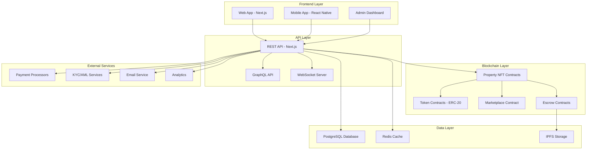

# PropertyChain Documentation Hub

Welcome to the complete documentation for PropertyChain - the blockchain-based real estate tokenization platform.

## 📚 Documentation Overview

This documentation hub provides comprehensive guides for users, developers, and administrators of the PropertyChain platform.

### For Users
- **[User Guide](./user-guide/README.md)**: Complete guide for investing in tokenized real estate
- **[Getting Started](./user-guide/README.md#getting-started)**: Quick start guide for new users
- **[FAQ](./user-guide/README.md#faq)**: Frequently asked questions
- **[Video Tutorials](https://propertychain.com/tutorials)**: Step-by-step video guides

### For Developers
- **[Developer Guide](./developers/README.md)**: Technical documentation for contributors
- **[API Reference](./api/openapi.yaml)**: Complete API documentation
- **[Smart Contracts](./smart-contracts/README.md)**: Blockchain integration guide
- **[Component Library](http://localhost:6006)**: Storybook component documentation

### For Administrators
- **[Admin Guide](./admin/README.md)**: Platform administration documentation
- **[Deployment Guide](./deployment/README.md)**: Production deployment instructions
- **[Security Guide](./security/README.md)**: Security best practices

## 🚀 Quick Navigation

| Document | Audience | Description |
|----------|----------|-------------|
| [User Guide](./user-guide/README.md) | Investors | How to use the platform |
| [Developer Guide](./developers/README.md) | Developers | Technical implementation |
| [API Docs](./api/openapi.yaml) | Integrators | API reference |
| [Admin Guide](./admin/README.md) | Administrators | Platform management |

## 🏗️ Architecture



## 🔧 Development Setup

### Prerequisites
- Node.js 18+
- npm or yarn
- Git
- MetaMask wallet

### Quick Start
```bash
# Clone the repository
git clone https://github.com/propertychain/platform.git
cd platform

# Install dependencies
npm install

# Copy environment variables
cp .env.example .env.local

# Start development server
npm run dev

# Start Storybook (component docs)
npm run storybook

# Run tests
npm run test
```

## 📖 Documentation Sections

### 1. User Documentation

**Target Audience**: End users, investors, property owners

- **Getting Started**: Account creation, KYC verification
- **Investment Guide**: How to browse and invest in properties
- **Portfolio Management**: Managing investments and tracking returns
- **Trading Guide**: Buying and selling tokens on secondary market
- **Mobile App**: Using the mobile application
- **Security**: Best practices for account security
- **Troubleshooting**: Common issues and solutions

### 2. Developer Documentation

**Target Audience**: Software developers, integrators

- **Architecture Overview**: System design and components
- **Development Setup**: Local development environment
- **API Integration**: REST and GraphQL APIs
- **Smart Contracts**: Blockchain integration
- **Frontend Development**: React/Next.js best practices
- **Testing**: Unit, integration, and E2E testing
- **Deployment**: CI/CD and production deployment
- **Contributing**: Code contribution guidelines

### 3. API Documentation

**Target Audience**: Third-party developers, integrators

- **OpenAPI Specification**: Complete API reference
- **Authentication**: JWT token-based authentication
- **Endpoints**: Detailed endpoint documentation
- **Rate Limiting**: API usage limits and best practices
- **SDKs**: Available software development kits
- **Webhooks**: Real-time event notifications
- **Examples**: Code samples and use cases

### 4. Smart Contract Documentation

**Target Audience**: Blockchain developers, auditors

- **Contract Architecture**: Smart contract design
- **Token Standards**: ERC-721, ERC-20 implementations
- **Security Patterns**: Best practices and security measures
- **Deployment**: Contract deployment procedures
- **Verification**: Contract verification on block explorers
- **Upgradeability**: Proxy patterns and upgrade procedures
- **Gas Optimization**: Cost-effective transaction patterns

### 5. Administrator Documentation

**Target Audience**: Platform administrators, operations team

- **Admin Dashboard**: Platform management interface
- **User Management**: User accounts and KYC administration
- **Property Management**: Listing and managing properties
- **Financial Operations**: Transaction monitoring and reporting
- **System Monitoring**: Health checks and alerting
- **Security Operations**: Security incident response
- **Backup and Recovery**: Data backup procedures

## 🛠️ Tools and Resources

### Development Tools
- **[Storybook](http://localhost:6006)**: Component documentation
- **[Swagger UI](http://localhost:3000/api-docs)**: API explorer
- **[GraphQL Playground](http://localhost:3000/graphql)**: GraphQL explorer
- **[Database Admin](http://localhost:3000/admin/db)**: Database management

### External Resources
- **[Hardhat](https://hardhat.org/)**: Smart contract development
- **[OpenZeppelin](https://openzeppelin.com/)**: Secure smart contract library
- **[Next.js](https://nextjs.org/)**: React framework documentation
- **[Tailwind CSS](https://tailwindcss.com/)**: Utility-first CSS framework

## 🔍 Search and Navigation

Use the following conventions to quickly find information:

- **🏠 User-facing**: Information for end users
- **👨‍💻 Developer**: Technical implementation details
- **🔧 Admin**: Administrative procedures
- **⚠️ Security**: Security-related information
- **📊 API**: API documentation
- **⛓️ Blockchain**: Smart contract information

## 📝 Documentation Standards

### Writing Guidelines

1. **Clear and Concise**: Use simple language, avoid jargon
2. **Structured**: Use headings, bullet points, and tables
3. **Examples**: Include code samples and screenshots
4. **Up-to-date**: Keep documentation current with code changes
5. **Accessible**: Consider users with different experience levels

### Code Documentation

```typescript
/**
 * Represents a property investment transaction
 * @interface Transaction
 * @property {string} id - Unique transaction identifier
 * @property {string} propertyId - Associated property ID
 * @property {number} tokenAmount - Number of tokens purchased
 * @property {number} amount - Total investment amount in USD
 * @property {TransactionStatus} status - Current transaction status
 * @example
 * const transaction: Transaction = {
 *   id: 'txn_123',
 *   propertyId: 'prop_456',
 *   tokenAmount: 100,
 *   amount: 10000,
 *   status: 'completed'
 * }
 */
interface Transaction {
  id: string
  propertyId: string
  tokenAmount: number
  amount: number
  status: TransactionStatus
}
```

### Markdown Standards

- Use descriptive headings
- Include table of contents for long documents
- Add code syntax highlighting
- Include diagrams using Mermaid
- Link to related documentation

## 🤝 Contributing to Documentation

### How to Contribute

1. **Fork the repository**
2. **Create a feature branch**: `git checkout -b docs/update-user-guide`
3. **Make your changes**: Edit markdown files
4. **Test locally**: Preview changes in browser
5. **Submit pull request**: Include description of changes

### Documentation Types

- **Fix**: Correct errors or broken links
- **Update**: Add new information or update existing
- **New**: Create new documentation sections
- **Improve**: Enhance clarity or structure

### Review Process

- All documentation changes require review
- Technical accuracy verified by subject matter experts
- User experience reviewed for clarity
- Changes deployed automatically after approval

## 📞 Support and Feedback

### Getting Help

- **User Support**: support@propertychain.com
- **Developer Support**: developers@propertychain.com
- **Documentation Issues**: docs@propertychain.com
- **Community Forum**: https://community.propertychain.com

### Feedback

Help us improve our documentation:

- **Report Issues**: Create GitHub issue for errors or gaps
- **Suggest Improvements**: Submit enhancement requests
- **Community Contributions**: Join our documentation team

## 📊 Documentation Statistics

- **Total Pages**: 50+
- **Code Examples**: 200+
- **API Endpoints**: 25+
- **Smart Contracts**: 10+
- **Languages**: English (primary), Spanish (planned)
- **Last Updated**: January 2024

---

**Version**: 1.0.0  
**Last Updated**: January 2024  
**Maintainers**: PropertyChain Documentation Team

For the most current information, visit [docs.propertychain.com](https://docs.propertychain.com)