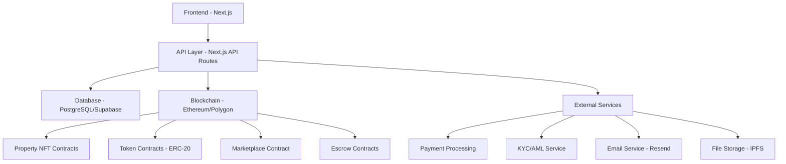

# PropertyChain Developer Documentation

Developer guide for contributing to and integrating with the PropertyChain platform.

## Table of Contents

1. [Getting Started](#getting-started)
2. [Architecture Overview](#architecture-overview)
3. [Development Setup](#development-setup)
4. [API Integration](#api-integration)
5. [Smart Contracts](#smart-contracts)
6. [Frontend Development](#frontend-development)
7. [Testing](#testing)
8. [Deployment](#deployment)
9. [Security Guidelines](#security-guidelines)
10. [Contributing](#contributing)

## Getting Started

### Prerequisites

- Node.js 18+ and npm
- Git
- MetaMask or compatible Web3 wallet
- Basic knowledge of TypeScript, React, and blockchain

### Quick Start

```bash
# Clone the repository
git clone https://github.com/propertychain/platform.git
cd platform

# Install dependencies
npm install

# Set up environment variables
cp .env.example .env.local
# Edit .env.local with your configuration

# Start development server
npm run dev

# Open http://localhost:3000
```

### Project Structure

```
propertychain/
├── src/
│   ├── app/                 # Next.js App Router pages
│   ├── components/          # Reusable React components
│   ├── lib/                 # Utility functions and configurations
│   ├── hooks/              # Custom React hooks
│   └── types/              # TypeScript type definitions
├── contracts/              # Smart contracts (Solidity)
├── scripts/               # Deployment and utility scripts
├── docs/                  # Documentation
├── public/               # Static assets
└── tests/               # Test files
```

## Architecture Overview

### High-Level Architecture



### Technology Stack

**Frontend:**
- Next.js 14+ (App Router)
- TypeScript
- Tailwind CSS
- Shadcn/ui components
- Framer Motion
- React Query/TanStack Query

**Backend:**
- Next.js API Routes
- Prisma ORM
- PostgreSQL
- Redis (caching)
- Supabase (Auth & Database)

**Blockchain:**
- Solidity smart contracts
- Hardhat development framework
- OpenZeppelin contracts
- Ethereum/Polygon networks
- IPFS for metadata storage

**Infrastructure:**
- Vercel (hosting)
- GitHub Actions (CI/CD)
- Sentry (error tracking)
- DataDog (monitoring)

## Development Setup

### Environment Configuration

Create `.env.local` file:

```bash
# App Configuration
NEXTAUTH_URL=http://localhost:3000
NEXTAUTH_SECRET=your-secret-here
NODE_ENV=development

# Database
DATABASE_URL="postgresql://..."
SUPABASE_URL=https://xxx.supabase.co
SUPABASE_ANON_KEY=your-anon-key

# Blockchain
NEXT_PUBLIC_CHAIN_ID=1
NEXT_PUBLIC_RPC_URL=https://mainnet.infura.io/v3/xxx
PRIVATE_KEY=your-private-key
ETHERSCAN_API_KEY=your-etherscan-key

# External Services
RESEND_API_KEY=your-resend-key
UPLOADTHING_SECRET=your-uploadthing-secret
UPLOADTHING_APP_ID=your-app-id

# Cache
REDIS_URL=redis://localhost:6379
UPSTASH_REDIS_REST_URL=https://xxx.upstash.io
UPSTASH_REDIS_REST_TOKEN=your-token

# Monitoring
SENTRY_DSN=your-sentry-dsn
NEXT_PUBLIC_SENTRY_DSN=your-public-dsn
```

### Local Development

1. **Install Dependencies**
   ```bash
   npm install
   ```

2. **Set Up Database**
   ```bash
   # Run migrations
   npx prisma migrate dev
   
   # Generate Prisma client
   npx prisma generate
   
   # Seed database (optional)
   npx prisma db seed
   ```

3. **Compile Smart Contracts**
   ```bash
   # Compile contracts
   npx hardhat compile
   
   # Run local blockchain
   npx hardhat node
   
   # Deploy contracts locally
   npx hardhat run scripts/deploy.ts --network localhost
   ```

4. **Start Development Server**
   ```bash
   npm run dev
   ```

### Development Scripts

```json
{
  "scripts": {
    "dev": "next dev",
    "build": "next build",
    "start": "next start",
    "lint": "next lint",
    "type-check": "tsc --noEmit",
    "test": "vitest",
    "test:e2e": "playwright test",
    "storybook": "storybook dev -p 6006",
    "compile": "hardhat compile",
    "deploy": "hardhat run scripts/deploy.ts",
    "verify": "hardhat verify"
  }
}
```

## API Integration

### Authentication

All API endpoints use JWT tokens from NextAuth.js:

```typescript
// Client-side authentication
import { useSession } from 'next-auth/react'

function MyComponent() {
  const { data: session, status } = useSession()
  
  if (status === 'loading') return <div>Loading...</div>
  if (status === 'unauthenticated') return <div>Access Denied</div>
  
  return <div>Welcome {session.user.email}</div>
}

// API route authentication
import { getServerSession } from 'next-auth'
import { authOptions } from '../auth/[...nextauth]'

export async function GET(request: NextRequest) {
  const session = await getServerSession(authOptions)
  
  if (!session) {
    return NextResponse.json(
      { error: 'Unauthorized' },
      { status: 401 }
    )
  }
  
  // Your API logic here
}
```

### Making API Requests

```typescript
// Using React Query for API calls
import { useQuery, useMutation } from '@tanstack/react-query'

// Fetch data
function useProperties() {
  return useQuery({
    queryKey: ['properties'],
    queryFn: async () => {
      const response = await fetch('/api/properties')
      return response.json()
    }
  })
}

// Mutate data
function useInvestInProperty() {
  return useMutation({
    mutationFn: async ({ propertyId, amount }: InvestmentData) => {
      const response = await fetch(`/api/properties/${propertyId}/invest`, {
        method: 'POST',
        headers: { 'Content-Type': 'application/json' },
        body: JSON.stringify({ amount })
      })
      return response.json()
    }
  })
}
```

### Error Handling

```typescript
// Standard error response format
interface APIError {
  error: string
  message: string
  details?: any
}

// Client-side error handling
const { data, error, isLoading } = useQuery({
  queryKey: ['properties'],
  queryFn: fetchProperties,
  onError: (error) => {
    console.error('Failed to fetch properties:', error)
    toast.error('Failed to load properties')
  }
})
```

### Rate Limiting

API endpoints are rate-limited using middleware:

```typescript
// Rate limiting configuration
const rateLimits = {
  '/api/auth/*': { requests: 10, window: 60000 }, // 10 per minute
  '/api/properties': { requests: 100, window: 60000 }, // 100 per minute
  '/api/transactions': { requests: 50, window: 60000 } // 50 per minute
}
```

## Smart Contracts

### Contract Architecture

```solidity
// Property NFT Contract
contract PropertyNFT is ERC721, AccessControl, Pausable {
    struct Property {
        uint256 totalTokens;
        uint256 tokenPrice;
        string metadataURI;
        bool isActive;
    }
    
    mapping(uint256 => Property) public properties;
    
    function mint(
        address to,
        uint256 tokenId,
        uint256 totalTokens,
        uint256 tokenPrice,
        string memory metadataURI
    ) public onlyRole(MINTER_ROLE) {
        _mint(to, tokenId);
        properties[tokenId] = Property({
            totalTokens: totalTokens,
            tokenPrice: tokenPrice,
            metadataURI: metadataURI,
            isActive: true
        });
    }
}
```

### Token Contract

```solidity
// Property Token Contract (ERC-20)
contract PropertyToken is ERC20, AccessControl {
    address public propertyNFT;
    uint256 public propertyId;
    
    constructor(
        string memory name,
        string memory symbol,
        uint256 totalSupply,
        uint256 _propertyId,
        address _propertyNFT
    ) ERC20(name, symbol) {
        propertyId = _propertyId;
        propertyNFT = _propertyNFT;
        _mint(msg.sender, totalSupply);
    }
}
```

### Deployment Scripts

```typescript
// scripts/deploy.ts
import { ethers } from 'hardhat'

async function main() {
  // Deploy Property NFT contract
  const PropertyNFT = await ethers.getContractFactory('PropertyNFT')
  const propertyNFT = await PropertyNFT.deploy()
  await propertyNFT.deployed()
  
  console.log('PropertyNFT deployed to:', propertyNFT.address)
  
  // Deploy Marketplace contract
  const Marketplace = await ethers.getContractFactory('PropertyMarketplace')
  const marketplace = await Marketplace.deploy(propertyNFT.address)
  await marketplace.deployed()
  
  console.log('Marketplace deployed to:', marketplace.address)
}

main().catch((error) => {
  console.error(error)
  process.exitCode = 1
})
```

### Contract Interaction

```typescript
// lib/contracts/property.ts
import { ethers } from 'ethers'
import PropertyNFTABI from './abis/PropertyNFT.json'

export class PropertyContract {
  private contract: ethers.Contract
  
  constructor(provider: ethers.Provider, contractAddress: string) {
    this.contract = new ethers.Contract(
      contractAddress,
      PropertyNFTABI,
      provider
    )
  }
  
  async getProperty(tokenId: number) {
    return await this.contract.properties(tokenId)
  }
  
  async mint(
    to: string,
    tokenId: number,
    totalTokens: number,
    tokenPrice: number,
    metadataURI: string,
    signer: ethers.Signer
  ) {
    const contractWithSigner = this.contract.connect(signer)
    const tx = await contractWithSigner.mint(
      to,
      tokenId,
      totalTokens,
      ethers.utils.parseEther(tokenPrice.toString()),
      metadataURI
    )
    return await tx.wait()
  }
}
```

## Frontend Development

### Component Guidelines

1. **Use TypeScript**: All components must be typed
2. **Follow naming conventions**: PascalCase for components
3. **Use Tailwind CSS**: For consistent styling
4. **Implement proper error boundaries**: Handle errors gracefully
5. **Add loading states**: Show feedback during async operations

```typescript
// Example component structure
interface PropertyCardProps {
  property: Property
  onInvest?: (propertyId: string, amount: number) => void
  className?: string
}

export function PropertyCard({ 
  property, 
  onInvest, 
  className 
}: PropertyCardProps) {
  const [isLoading, setIsLoading] = useState(false)
  
  const handleInvest = async (amount: number) => {
    setIsLoading(true)
    try {
      await onInvest?.(property.id, amount)
    } catch (error) {
      console.error('Investment failed:', error)
    } finally {
      setIsLoading(false)
    }
  }
  
  return (
    <Card className={cn('property-card', className)}>
      {/* Component JSX */}
    </Card>
  )
}
```

### State Management

```typescript
// Using Zustand for global state
import { create } from 'zustand'

interface AppState {
  user: User | null
  portfolio: Portfolio | null
  setUser: (user: User) => void
  setPortfolio: (portfolio: Portfolio) => void
}

export const useAppStore = create<AppState>((set) => ({
  user: null,
  portfolio: null,
  setUser: (user) => set({ user }),
  setPortfolio: (portfolio) => set({ portfolio })
}))
```

### Styling Guidelines

```css
/* Use Tailwind utility classes */
.property-card {
  @apply bg-white rounded-lg shadow-md p-6 hover:shadow-lg transition-shadow;
}

/* Custom CSS variables for theme colors */
:root {
  --primary: 220 14% 9%;
  --primary-foreground: 210 40% 98%;
  --secondary: 210 40% 96%;
  --accent: 210 40% 94%;
}
```

## Testing

### Unit Tests

```typescript
// components/__tests__/PropertyCard.test.tsx
import { render, screen, fireEvent } from '@testing-library/react'
import { PropertyCard } from '../PropertyCard'

const mockProperty = {
  id: '1',
  title: 'Test Property',
  price: 100000,
  tokenPrice: 100,
  expectedROI: 7.5
}

describe('PropertyCard', () => {
  it('renders property information', () => {
    render(<PropertyCard property={mockProperty} />)
    
    expect(screen.getByText('Test Property')).toBeInTheDocument()
    expect(screen.getByText('$100,000')).toBeInTheDocument()
    expect(screen.getByText('7.5%')).toBeInTheDocument()
  })
  
  it('calls onInvest when invest button is clicked', () => {
    const onInvest = vi.fn()
    render(<PropertyCard property={mockProperty} onInvest={onInvest} />)
    
    fireEvent.click(screen.getByText('Invest Now'))
    
    expect(onInvest).toHaveBeenCalledWith('1', expect.any(Number))
  })
})
```

### E2E Tests

```typescript
// tests/e2e/investment-flow.spec.ts
import { test, expect } from '@playwright/test'

test('complete investment flow', async ({ page }) => {
  // Navigate to property page
  await page.goto('/properties/1')
  
  // Click invest button
  await page.click('button:has-text("Invest Now")')
  
  // Enter investment amount
  await page.fill('input[name="amount"]', '1000')
  
  // Connect wallet (mock)
  await page.click('button:has-text("Connect Wallet")')
  
  // Confirm transaction
  await page.click('button:has-text("Confirm Investment")')
  
  // Wait for success message
  await expect(page.locator('.success-message')).toBeVisible()
})
```

### Smart Contract Tests

```typescript
// test/PropertyNFT.test.ts
import { expect } from 'chai'
import { ethers } from 'hardhat'

describe('PropertyNFT', () => {
  let propertyNFT: any
  let owner: any
  let addr1: any
  
  beforeEach(async () => {
    [owner, addr1] = await ethers.getSigners()
    const PropertyNFT = await ethers.getContractFactory('PropertyNFT')
    propertyNFT = await PropertyNFT.deploy()
  })
  
  it('should mint property NFT', async () => {
    const tokenId = 1
    const totalTokens = 1000
    const tokenPrice = ethers.utils.parseEther('100')
    const metadataURI = 'https://metadata.com/1'
    
    await propertyNFT.mint(
      addr1.address,
      tokenId,
      totalTokens,
      tokenPrice,
      metadataURI
    )
    
    expect(await propertyNFT.ownerOf(tokenId)).to.equal(addr1.address)
    
    const property = await propertyNFT.properties(tokenId)
    expect(property.totalTokens).to.equal(totalTokens)
    expect(property.tokenPrice).to.equal(tokenPrice)
  })
})
```

## Deployment

### Environment Setup

**Staging:**
```bash
# Deploy to staging
npm run build
vercel --prod --env NEXT_PUBLIC_ENV=staging

# Run migrations
npx prisma migrate deploy

# Deploy contracts
npx hardhat run scripts/deploy.ts --network goerli
```

**Production:**
```bash
# Deploy to production
npm run build
vercel --prod

# Run migrations
DATABASE_URL=$PRODUCTION_DATABASE_URL npx prisma migrate deploy

# Deploy contracts
npx hardhat run scripts/deploy.ts --network mainnet
```

### CI/CD Pipeline

```yaml
# .github/workflows/deploy.yml
name: Deploy to Production

on:
  push:
    branches: [main]

jobs:
  test:
    runs-on: ubuntu-latest
    steps:
      - uses: actions/checkout@v3
      - uses: actions/setup-node@v3
        with:
          node-version: '18'
      - run: npm ci
      - run: npm run test
      - run: npm run test:e2e

  deploy:
    needs: test
    runs-on: ubuntu-latest
    steps:
      - uses: actions/checkout@v3
      - uses: actions/setup-node@v3
        with:
          node-version: '18'
      - run: npm ci
      - run: npm run build
      - uses: amondnet/vercel-action@v20
        with:
          vercel-token: ${{ secrets.VERCEL_TOKEN }}
          vercel-org-id: ${{ secrets.ORG_ID }}
          vercel-project-id: ${{ secrets.PROJECT_ID }}
```

## Security Guidelines

### Code Security

1. **Input Validation**: Validate all user inputs
2. **SQL Injection Prevention**: Use parameterized queries
3. **XSS Prevention**: Sanitize all user-generated content
4. **CSRF Protection**: Use CSRF tokens for state changes
5. **Rate Limiting**: Implement rate limiting on all endpoints

### Smart Contract Security

```solidity
// Security patterns
contract SecureContract is ReentrancyGuard, Pausable, AccessControl {
    using SafeMath for uint256;
    
    modifier onlyValidAddress(address _addr) {
        require(_addr != address(0), "Invalid address");
        _;
    }
    
    function secureFunction(uint256 amount) 
        external 
        nonReentrant 
        whenNotPaused 
        onlyValidAddress(msg.sender) 
    {
        require(amount > 0, "Amount must be positive");
        // Function logic
    }
}
```

### Environment Variables

```bash
# Never commit these to version control
PRIVATE_KEY=0x... # Use environment variables
ADMIN_WALLET=0x... # Separate from development wallet
API_SECRETS=... # Rotate regularly
```

## Contributing

### Git Workflow

1. **Fork the Repository**
2. **Create Feature Branch**
   ```bash
   git checkout -b feature/your-feature-name
   ```
3. **Make Changes**
4. **Write Tests**
5. **Submit Pull Request**

### Code Review Process

- All changes require code review
- Tests must pass
- Code coverage must not decrease
- Security review for sensitive changes

### Commit Message Format

```
type(scope): description

feat(auth): add two-factor authentication
fix(api): resolve property listing bug
docs(readme): update installation instructions
test(components): add PropertyCard tests
```

### Pull Request Template

```markdown
## Description
Brief description of changes

## Type of Change
- [ ] Bug fix
- [ ] New feature
- [ ] Breaking change
- [ ] Documentation update

## Testing
- [ ] Unit tests pass
- [ ] E2E tests pass
- [ ] Manual testing completed

## Security
- [ ] No security vulnerabilities introduced
- [ ] Sensitive data handled properly
```

## Resources

- [Next.js Documentation](https://nextjs.org/docs)
- [TypeScript Handbook](https://www.typescriptlang.org/docs)
- [Solidity Documentation](https://docs.soliditylang.org)
- [Hardhat Documentation](https://hardhat.org/docs)
- [OpenZeppelin Contracts](https://docs.openzeppelin.com/contracts)

## Support

- **Technical Questions**: tech@propertychain.com
- **Bug Reports**: Create GitHub issue
- **Security Issues**: security@propertychain.com
- **Discord**: [PropertyChain Developers](https://discord.gg/propertychain)

---

*Last Updated: January 2024*
*Version: 1.0.0*